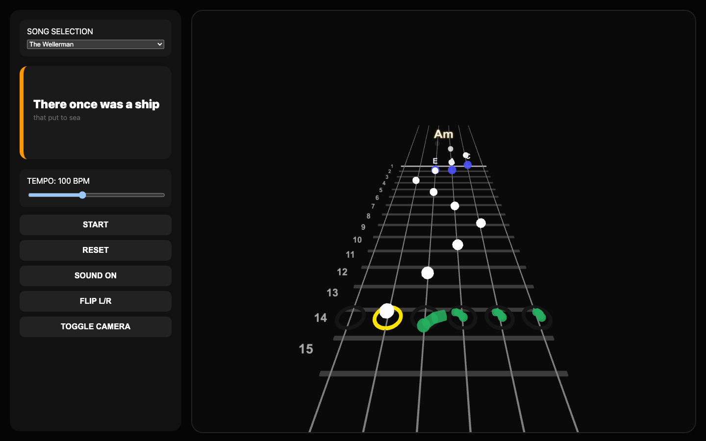
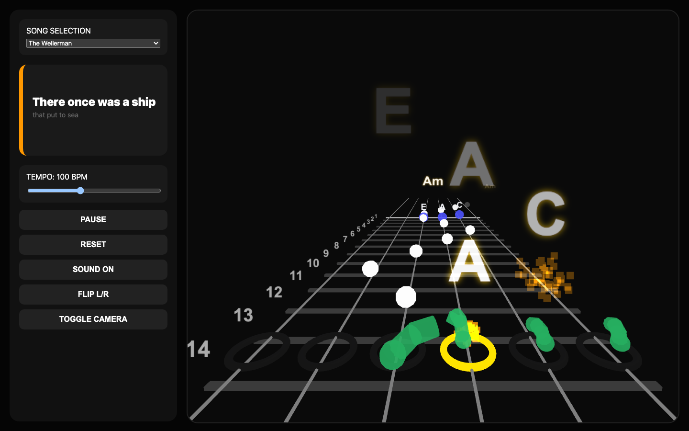
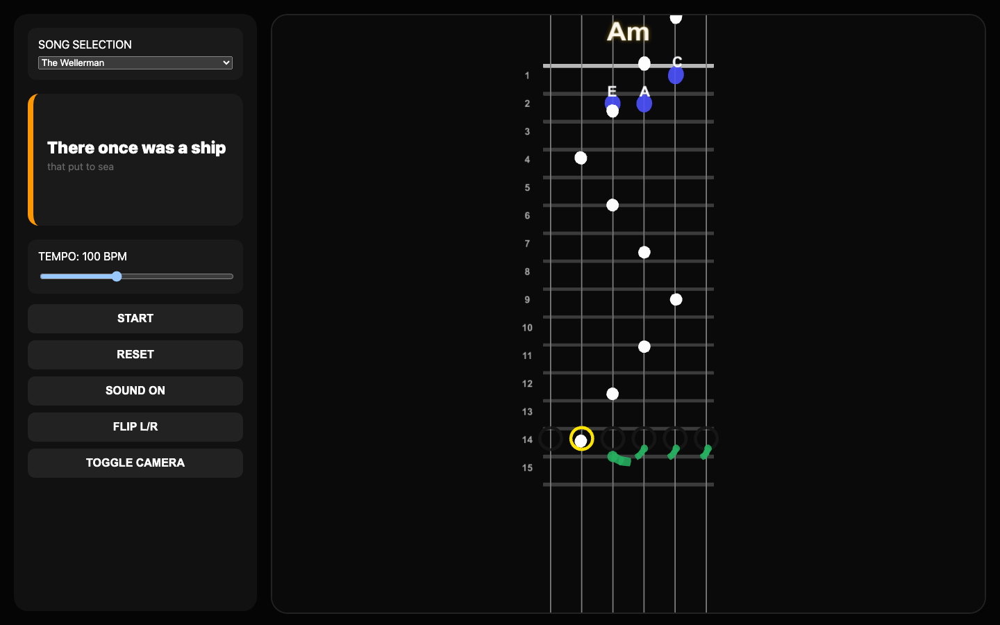
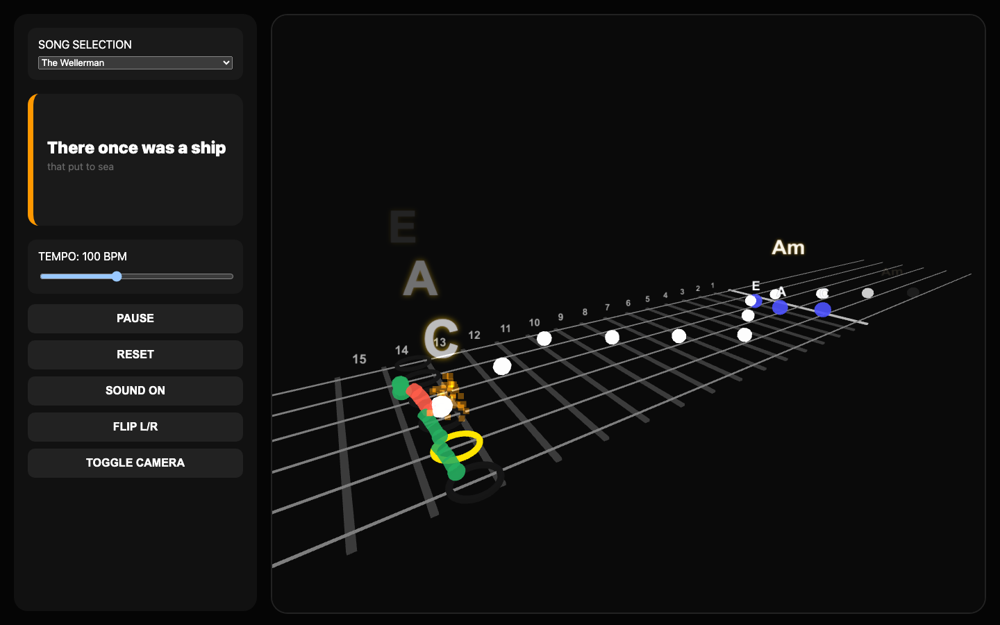

# Guitar Tabs

Interactive guitar practice prototype with a Three.js fretboard renderer, chord-timed note playback, plucking-hand visualization, and camera-aware view validation.

## Screenshots

### Classic Overview


### Player Playback


### Birdseye Overview


### Cinematic Playback


Screenshots are generated from the live app with the existing camera toggle flow:

```bash
npm run capture:screenshots
```

## What The App Does

- Renders a six-string fretboard in 3D with multiple camera views.
- Builds a timed note sequence from song scripts and chord arpeggio patterns.
- Plays synthesized plucks through the Web Audio API.
- Draws left-hand note labels directly in the 3D scene.
- Draws a 3D current/next chord display near the first-fret area.
- Animates a simplified right-hand finger rig with pre-pluck anticipation and post-pluck motion.

## Project Structure

- `src/main.ts`
  - application state
  - DOM wiring
  - song timeline updates
  - render-loop integration
- `src/renderer.ts`
  - Three.js scene setup
  - camera switching
  - fretboard/string rendering
  - scene-level labels and effects
- `src/virtualHand.ts`
  - right-hand finger rig meshes
  - finger coloring, scaling, and anticipation visuals
- `src/handGeometry.ts`
  - pure right-hand mapping and pose helpers
- `src/chordTimeline.ts`
  - chord-segment timing helpers
- `src/chordDisplay3D.ts`
  - 3D current/next chord labels
- `src/viewFraming.ts`
  - projection helpers for camera/layout validation
- `tests/main.go`
  - browser smoke test with runtime-state validation
- `tests/capture_views.go`
  - screenshot capture script

## Runtime Notes

- Default development server:

```bash
npm run dev
```

- Vite defaults to `http://127.0.0.1:5173/` unless you override the port.
- The browser smoke test currently expects the app on `http://127.0.0.1:5174/`.
- For that path, start Vite explicitly on `5174`:

```bash
npm run dev -- --host 127.0.0.1 --port 5174 --strictPort
```

## Installation

### Prerequisites

- Node.js 20+
- Go 1.25+ for the browser test and screenshot capture utilities

### Setup

```bash
npm install
```

## Test And Validation Commands

Unit and integration tests:

```bash
npm test
```

View/framing checks:

```bash
npm run test:view
```

Browser smoke test:

```bash
npm run test:ui
```

Headed browser smoke test:

```bash
npm run test:ui:headed
```

Production build:

```bash
npm run build
```

## View-Check System

The view-check system is intended to prevent geometry from drifting out of frame as scene layout changes.

It currently validates:

- fretboard corners
- chord-display anchors
- left-hand note-label anchors
- right-hand pluck-zone anchors

It currently measures:

- left/right/top/bottom projected margins
- whether anchors remain inside the viewport
- whether the classic camera leaves extra bottom margin under the fretboard

The report includes desktop, tablet, and portrait aspect ratios so camera/layout changes can be evaluated before adjusting the renderer.

## Current Limitations

- Camera framing is validated against anchor points, not full rendered pixel bounds.
- The browser smoke test validates runtime state and interaction flow, but it does not do image-diff assertions.
- The right-hand rig is intentionally schematic; it is not an anatomical hand model.
