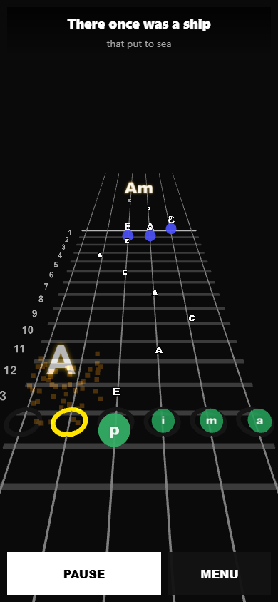
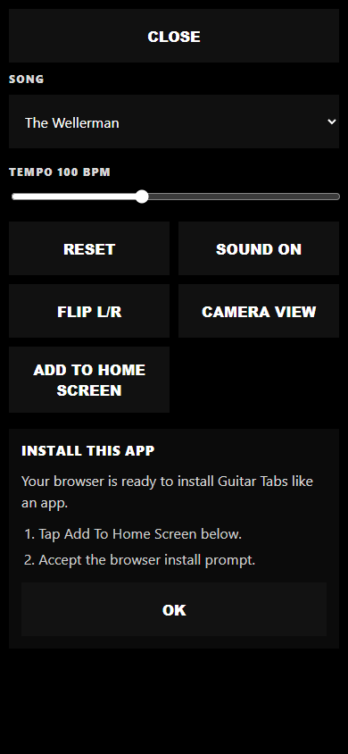
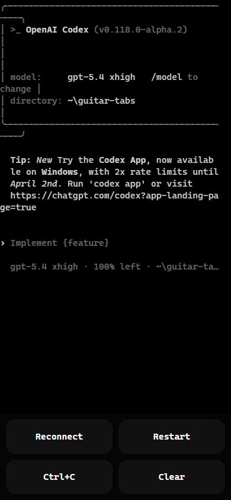

# Guitar Tabs

Live site: [https://timcash.github.io/guitar-tabs/](https://timcash.github.io/guitar-tabs/)

Mobile-first 3D guitar practice player with a built-in Codex terminal.

## Recent Mobile Screenshots

| Player Stage | Fullscreen Menu | Codex Terminal |
| --- | --- | --- |
|  |  |  |

## Routes

- `/`
  - Mobile guitar player
- `/readme`
  - Padded markdown preview of this README
- `/codex`
  - Full-page `xterm.js` terminal connected to the local Codex CLI
  - In the static GitHub Pages build, this route shows `OFFLINE`

## Live Site

The static site is intended to publish on GitHub Pages at:

- `https://timcash.github.io/guitar-tabs/`

Notes:

- This is a GitHub Pages site URL, not the GitHub repository page.
- The Pages build supports direct loads of `/`, `/readme`, and `/codex`.
- `/codex` is intentionally offline on Pages until a hosted backend bridge exists.

## Domain Language

Use these names when reading or changing the system:

- `fret-board`
  - 3D strings, frets, and fret labels
- `sliding-notes`
  - Note labels that slide down each string toward the bridge
- `pluck-zone`
  - Bridge-side target area where notes are played
- `picking-fingers`
  - Right-hand finger markers: `p`, `i`, `m`, `a`, `c`
- `chord-fingers`
  - Left-hand chord markers placed on the fret-board
- `next-chord-display`
  - Active and incoming chord display
- `lyrics-panel-ui`
  - The words shown over the guitar
- `menu-ui`
  - Fullscreen mobile control menu
- `readme-preview-ui`
  - Markdown route used to read this README in the browser
- `codex-terminal-ui`
  - Browser terminal route backed by `xterm.js`
- `codex-bridge`
  - Local WebSocket and PTY bridge that launches the Codex CLI
- `playback-transport`
  - Play, pause, reset, elapsed time
- `audio-pluck`
  - Web Audio pluck synthesis
- `pluck-burst-effects`
  - Bridge-hit particles and floating note pop labels
- `runtime-test-bridge`
  - Browser state published for end-to-end tests
- `pwa-shell`
  - Manifest, homescreen icons, install metadata, and service worker for mobile install

## How The Guitar Works

1. The selected song expands into a timed `chord-timeline`.
2. The `chord-timeline` becomes a `sliding-note-sequence` of string plucks.
3. Each note becomes a `sliding-note` label that moves down one string toward the `pluck-zone`.
4. When a note reaches the bridge, the `audio-pluck` engine plays it and the `picking-fingers` animate the pluck.
5. The active chord updates the `chord-fingers` on the fret-board.
6. The `next-chord-display` shows what chord is active now and what is coming next.
7. The main stage stays minimal: lyrics plus `START/PAUSE` and `MENU`.
8. The fullscreen `menu-ui` holds song selection, tempo, reset, sound, flip, and camera controls.

## Render And Audio Reuse

- The `fret-board`, `chord-fingers`, `pluck-zone`, and `sliding-notes` use fixed Three.js meshes and sprite slots that are updated in place.
- `pluck-burst-effects` are pooled, so bridge-hit particles and floating note labels are reused instead of recreated on every pluck.
- Note-label textures are prewarmed and cached, which keeps note-name canvases out of the hot render path.
- The `audio-pluck` system caches pitch lookup and per-string output gains so each pluck only creates the short-lived oscillator and envelope nodes it actually needs.
- The `next-chord-display` only redraws its canvas labels when the chord text changes.

## How To Use The Guitar Player

1. Open `/`.
2. Tap `START`.
3. Read the lyric line at the top while the `sliding-notes` move toward the bridge.
4. Open `MENU` when you want to change song, tempo, sound, left/right flip, or camera view.
5. Tap `RESET` from the menu to restart the current song.

## Install As An App

The site is set up as a PWA so it can be added to the home screen on both Android and iPhone.

Android:

1. Open `https://timcash.github.io/guitar-tabs/` in Chrome.
2. Use the browser install prompt or the browser menu.
3. Choose `Install app` or `Add to Home screen`.

iPhone:

1. Open `https://timcash.github.io/guitar-tabs/` in Safari.
2. Tap the Share button.
3. Choose `Add to Home Screen`.

PWA notes:

- The installed app opens in standalone mode.
- The app includes homescreen icons for Android and iPhone.
- The service worker caches the app shell and common static assets for faster repeat loads and basic offline fallback.
- The GitHub Pages build keeps `/codex` in an offline state until a hosted backend bridge exists.

## Main System Parts

```text
GuitarTabsApp
  AppShellUI
  PlaybackTransport
  SongSession
    SlidingNoteSequenceBuilder
  FretboardRenderer
  AudioPluckEngine
  RuntimeTestBridge
  CodexTerminalPage
```

## File Map

```text
src/
  app/
    GuitarTabsApp.ts
  ui/
    AppShellUI.ts
    ReadmePreviewPage.ts
  codex/
    CodexTerminalPage.ts
    CodexTerminalView.ts
    CodexRouteState.ts
    CodexTerminalClient.ts
  domain/
    session/
      SongSession.ts
    timeline/
      SlidingNoteSequenceBuilder.ts
  playback/
    PlaybackTransport.ts
  audio/
    AudioPluckEngine.ts
    NoteNameService.ts
  pwa/
    registerServiceWorker.ts
  testing/
    RuntimeTestBridge.ts
  renderer.ts
  virtualHand.ts
  chordDisplay3D.ts
  viewFraming.ts
public/
  manifest.webmanifest
  service-worker.js
  apple-touch-icon.png
  pwa-192.png
  pwa-512.png
  pwa-maskable-192.png
  pwa-maskable-512.png
server/
  codex/
    CodexBridgeServer.ts
    CodexExecutableResolver.ts
    CodexPtySession.ts
    CodexSessionRegistry.ts
shared/
  codex/
    CodexBridgeTypes.ts
```

## Domain Notes In Code

- `FallingNote` is the legacy TypeScript name for a `sliding-note`.
- `currentChord` in older code means the active chord in the `next-chord-display`.
- `nextChord` in older code means the incoming chord in the `next-chord-display`.
- `rightHand` in older code maps to `picking-fingers`.
- `leftHandMarkers` in older code maps to `chord-fingers`.
- `rightHandMarkers` in older code maps to the `pluck-zone`.

## End-To-End Test Coverage

The browser smoke test covers all user-facing pages:

- `/`
  - Starts playback
  - Opens and closes the fullscreen menu
  - Changes song and tempo
  - Toggles camera, sound, and left/right flip
- `/readme`
  - Verifies the markdown page renders images and scrolls
- `/codex`
  - Verifies `xterm.js` mounts
  - Verifies the action buttons work

The mobile screenshots at the top of this README are refreshed by `npm run test:ui`.

## Local Dev

`npm run dev` starts the Vite app and the local Codex bridge together. It is designed to be idempotent for local use, so rerunning it cleans up the previous managed dev processes on ports `5174` and `4176` before starting fresh ones.

## GitHub Pages Deploy

The repo includes a GitHub Actions workflow that builds and deploys the static app to GitHub Pages:

- Workflow file: `.github/workflows/deploy-pages.yml`
- Build command: `npm run build:pages`
- Static Pages build helper: `scripts/build-pages.mjs`

What the workflow does:

1. Runs on pushes to `master` and on manual workflow dispatch.
2. Installs dependencies with `npm ci`.
3. Builds the site with the repo base path `/guitar-tabs/`.
4. Forces `VITE_CODEX_OFFLINE=1` for the Pages build so `/codex` renders an offline terminal instead of trying to reach a local bridge.
5. Publishes the `dist/` folder to GitHub Pages, including the `pwa-shell` files.

One-time GitHub setup:

1. Open repo `Settings`.
2. Open `Pages`.
3. Set the source to `GitHub Actions`.

After the workflow finishes, the site should be available at `https://timcash.github.io/guitar-tabs/`.

## `/codex` Page

`/codex` is a browser terminal for the real local Codex CLI.

How to use it:

1. Open `/codex`.
2. Type directly in the terminal, not in a separate input box.
3. Use normal Codex slash commands such as `/status` and subagent commands from the real CLI.
4. Use the bottom action buttons for quick `Clear` and `Restart`.
5. Optionally preload a prompt with `?prompt=<base64_string>`.

Notes:

- It uses the local Codex credentials already available on the machine.
- It runs the local CLI in dangerous local mode right now, so it is intended for local development only.
- The route is designed to feel like the CLI TUI inside the browser, not a reimplementation of Codex behavior.
- In the GitHub Pages build, this route shows an `OFFLINE` terminal because there is no hosted Codex bridge yet.
