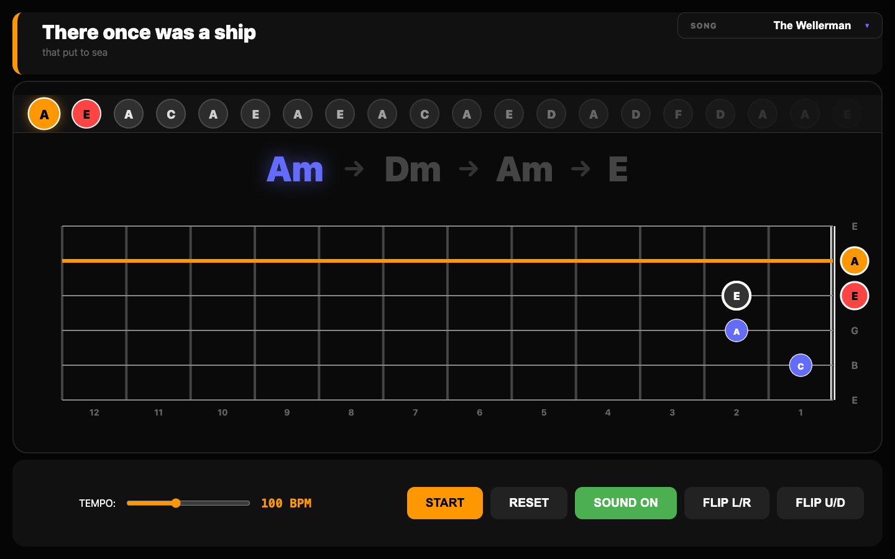

# 🎸 Guitar Tab Master



A high-fidelity, interactive guitar practice application designed to help you master songs like "The Wellerman" and "House of the Rising Sun". This trainer features a full-width horizontal fretboard, real-time note synthesis, and a dynamic "Note Stream" roadmap.

## ✨ Features

- **Dynamic Horizontal Fretboard**: Spans your entire screen for maximum visibility.
- **Visual Roadmap**: 
  - **Blue**: Current chord positions.
  - **Orange**: The specific string/note being plucked right now.
  - **Red**: The very next note to prepare for.
  - **Dark Grey**: Shadow positions for the next chord change.
- **Interactive Note Stream**: A "Guitar Hero" style timeline at the top showing all upcoming notes in the sequence.
- **Audio Synthesis**: High-quality Web Audio API tones for every pluck, calculated across the correct octaves.
- **Tempo Control**: Practice as slow as 10 BPM or as fast as 240 BPM.
- **Full Orientation Control**: Flip the board Left/Right (Handedness) or Up/Down (Player's View vs. Tab View).
- **Song Library**: Switch between different song scripts instantly.

## 🚀 Getting Started

### Prerequisites

- [Node.js](https://nodejs.org/) (v20 or newer recommended)
- [Nix](https://nixos.org/) (Optional, for development environment)

### Installation

1. **Clone the repository:**
   ```bash
   git clone https://github.com/timcash/guitar-tabs.git
   cd guitar-tabs
   ```

2. **Install dependencies:**
   ```bash
   npm install
   ```

3. **Start the development server:**
   ```bash
   npm run dev
   ```

4. **Open your browser:**
   Navigate to [http://localhost:5173/](http://localhost:5173/)

## 🛠️ Built With

- **Vite** - Lightning fast build tool.
- **TypeScript** - For robust, type-safe logic.
- **Web Audio API** - For real-time guitar note synthesis.
- **SVG & CSS Grid** - For a responsive, hardware-accelerated UI.

## 📄 License

This project is open-source and available under the MIT License.
